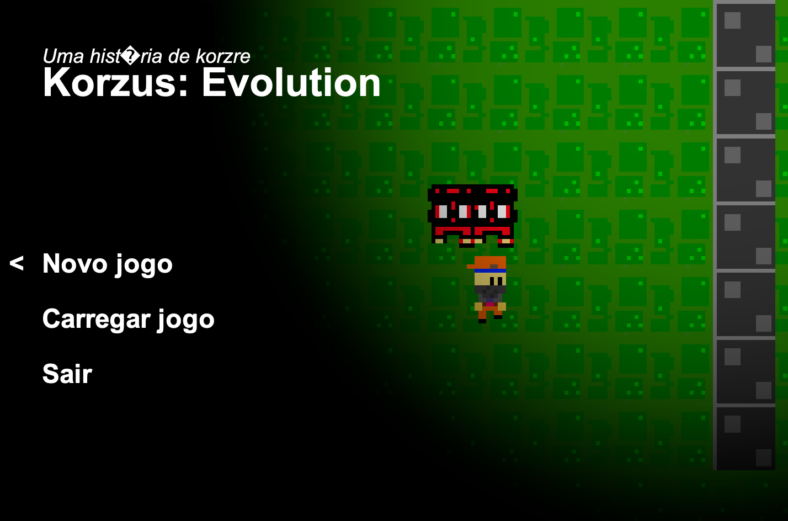

# Korzus: Evolution



A retro 2D top-down action shooter game built from scratch in pure Java using standard AWT/Swing graphics without external gaming libraries.


## 🎮 Game Overview

**Korzus: Evolution** puts players in a top-down maze arena filled with hostile enemies. Players must explore the map, collect ammo and health kits, and eliminate all enemies to progress to the next level.


## ✨ Features

- **Custom 2D Game Engine:** Built with Java 8 (`Canvas`, `BufferStrategy`, custom game loop at fixed 60 FPS).
- **Pixel-Art Graphics:** Low-resolution rendering (240x160 scaled 3x) for an authentic 8-bit / 16-bit retro feeling.
- **Image-Based Map Generation:** Levels are read and generated dynamically from pixel color maps (`level1.png`).
- **Interactive Gameplay:** Player movement, mouse-aim shooting, health management, and ammo pickups.
- **Menu & Save System:** In-game pause menu, game over restart loop, and state saving support.


## 🛠️ Built With

- **Language:** Java 8 (JavaSE-1.8)
- **GUI Framework:** Java AWT / Swing (`javax.swing`, `java.awt`)
- **IDE:** Eclipse / Any Java IDE


## 🎯 Controls

| Key / Action | Function |
| :--- | :--- |
| **W, A, S, D** or **Arrow Keys** | Player Movement / Menu Navigation |
| **Spacebar** or **Left Mouse Click** | Shoot weapon |
| **ENTER** | Select menu option / Restart game after Game Over |
| **ESC** | Pause game / Open Menu |
| **Caps Lock** | Save game state |


## 🚀 How to Run

1. Clone this repository:
   ```bash
   git clone https://github.com/Korzre/korzus-evolution-java.git
   ```

2. Open the project in your favorite Java IDE (Eclipse, IntelliJ IDEA, NetBeans, or VS Code).

3. Locate com.main.Game.java.

4. Run Game.java as a Java Application.


#### This project was originally developed in 2020 as a custom game development experiment in Java. Level 1 is fully playable with full combat mechanics, health/ammo pickups, and UI.

## 📜 License

This project is open-source and available under the MIT License.